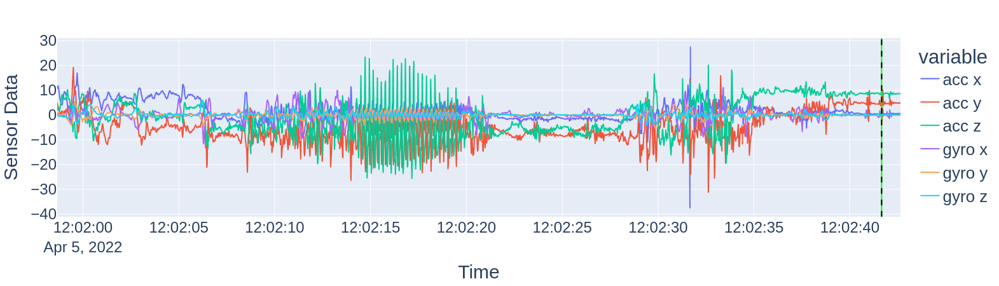
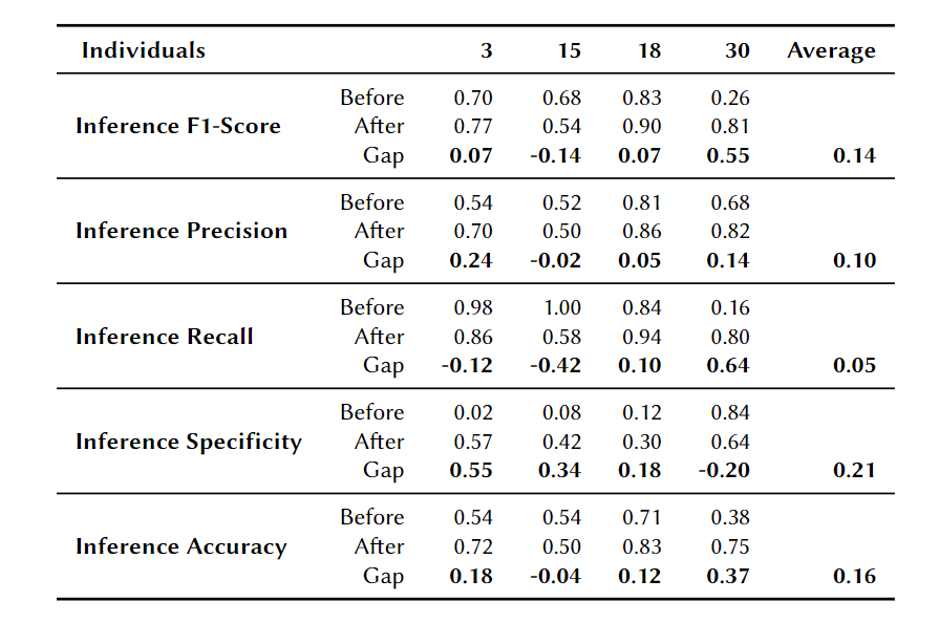

# Deep Learning-Based Detection of Obsessive-Compulsive Hand Washing

## Description
This repository contains the code and resources for the Master Thesis titled, "Deep Learning-Based Detection of Obsessive-Compulsive Hand Washing". The project aims to develop an automated system using deep learning methods to detect instances of enacted obsessive-compulsive hand washing behavior.

## The Methodology of this paper is as follows:


## Tasks Types:
- Task 1: Null vs. HW (HandWashing)
- Task 2: rHW (Routine Handwashing) vs. cHW (Compulsive Handwashing)
- Task 3: Null vs. rHW vs. rHW 
- Task 4: Null vs. cHW
- Task 5: DL model personalization

## Installation:
The project requires a Linux system that is equipped with Cuda 11.7.

All subsequent commands assume that you have cloned the repository in your terminal and navigated to its location.

A file named "env.yml" contains all necessary python dependencies.

To conveniently install them automatically with [anaconda](https://www.anaconda.com/) you can use:

```
conda env create -f env.yml

conda activate ml23
```
## Data
To replicate our experiments, please download the corresponding processed [data](https://uni-siegen.sciebo.de/s/kkelXc845wQ1qCe) for DeepLearning experiments and feature [data](https://uni-siegen.sciebo.de/s/Nbp2mnv9Ka1Wh2a) for ML experiments. Extract these zip files into the `data` folder.


## Config files
The folder `configs` consists of different configurations for different tasks which names must be passed as an argument for targeted task.
As per the thesis work, following configs files are as indicated in the file_name


## Reconstruction
```
$ python main.py configs/[config_file_name] --m [method] --t [task_type] --d 
```

## Data prepration
- To prepare dataset before running pass flag `--d`
- The original datset `OCDetect_Export` by Burchard et al. must be inside data folder.
- If not passed, the pre-existed data will be used. 

### Run DL Tasks:
- Pass `--d` to pre-process before start training
```
$ python main.py configs/task1_adam.yaml --m dl
$ python main.py configs/task1_sgd.yaml --m dl

$ python main.py configs/task2_adam.yaml --m dl
$ python main.py configs/task2_sgd.yaml --m dl

$ python main.py configs/task3_adam.yaml --m dl
$ python main.py configs/task3_sgd.yaml --m dl

$ python main.py configs/task4_adam.yaml --m dl
$ python main.py configs/task4_sgd.yaml --m dl

$ python main.py configs/task5_adam.yaml --m dl
$ python main.py configs/task5_sgd.yaml --m dl

```
**None:** To run Task-5, Task-2 must be completed so that the best models will be saved in `best_model` folder.
**None:** To run Task-5, Task-2 must be completed so that the best models will be saved in `best_model` folder.

### Run ML Tasks:
- Pass `--d` to pre-process before start training
```
$ python main.py configs/task1_adam.yaml --m ml
$ python main.py configs/task1_sgd.yaml --m ml

$ python main.py configs/task2_adam.yaml --m ml
$ python main.py configs/task2_sgd.yaml --m ml

$ python main.py configs/task3_adam.yaml --m ml
$ python main.py configs/task3_sgd.yaml --m ml

$ python main.py configs/task4_adam.yaml --m ml
$ python main.py configs/task4_sgd.yaml --m ml

```
**None:** To run Task-5, Task-2 must be completed so that the best models will be saved in `best_model` folder.
**None:** To run Task-5, Task-2 must be completed so that the best models will be saved in `best_model` folder.


## Folder Structures
The 'saved' folder consists of folders where the results will be stored.
- Logs are stored in `logs` folder
- Charts are stored in `charts` folder
- Models are stored in `models` folder
- Results are stored in `results` folder

```
├── saved
│   ├── 2024-01-24..
│   ├     ├── charts
│   ├     ├── logs
│   ├     ├── models
│   ├     ├── results
│   ├           ├── 2024-01-24.csv
├── src
└── .gitignore
```

## Running in OMNI-Cluster (University of Siegen)
The jobscripts are stored inside `jobscripts` folder

### Run DL pipeline Task 1 to Task 4 
```
$ bash run_dl.sh
```

## Run ML pipeline Task 4 to Task 4
```
$ bash run_ml.sh
```

## Run Personalization after completion of DL pipeline
```
$ bash run_personalized.sh
```


# Results

## Data visualization


## Task 2: rHW vs cHW


## Task 5: DL Personalization [rHW vs cHW]



## Contact
For questions and comments please contact [Amir Thapa Magar](amir.thapamagar@student.uni-siegen.de) via mail

