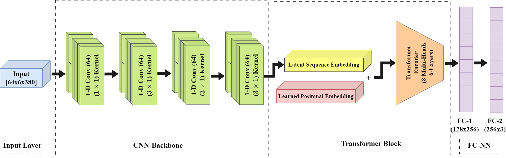

# Deep Learning-Based Detection of Obsessive-Compulsive Hand Washing

## Description
This repository contains the code and resources for the Master Thesis titled, "Deep Learning-Based Detection of Obsessive-Compulsive Hand Washing". The project aims to develop an automated system using deep learning methods to detect instances of enacted obsessive-compulsive hand washing behavior.

## The Methodology of this paper is as follows:


## Tasks:
- Null vs. HW (HandWashing)
- rHW (Routine Handwashing) vs. cHW (Compulsive Handwashing)
- Null vs. rHW vs. rHW 
- Null vs. cHW
- DL model personalization

## Install:
The project requires a Linux system that is equipped with Cuda 11.7.

All subsequent commands assume that you have cloned the repository in your terminal and navigated to its location.

A file named "env.yml" contains all necessary python dependencies.

To conveniently install them automatically with [anaconda](https://www.anaconda.com/) you can use:

```
conda env create -f env.yml

conda activate ml23
```
## Data
To replicate our experiments, please download the corresponding processed [data](https://uni-siegen.sciebo.de/s/kkelXc845wQ1qCe) for DeepLearning experiments and feature [data](https://uni-siegen.sciebo.de/s/Nbp2mnv9Ka1Wh2a) for ML experiments. Extract these zip files into the `data` folder.


## Config files
The folder `configs` consists of different configurations for different tasks which names must be passed as an argument for targeted task.

## Methodology
- For DL models, pass "dl" as an argument while running the script. 
- For ML modles, pass "ml".

## Reconstruction
To train model
```
python main.py configs/[config_file_name] [method]
```

## Saved Files
The 'saved' folder consists of folders where the results will be stored.

## Contact
For questions and comments please contact [Amir Thapa Magar](amir.thapamagar@student.uni-siegen.de) via mail

